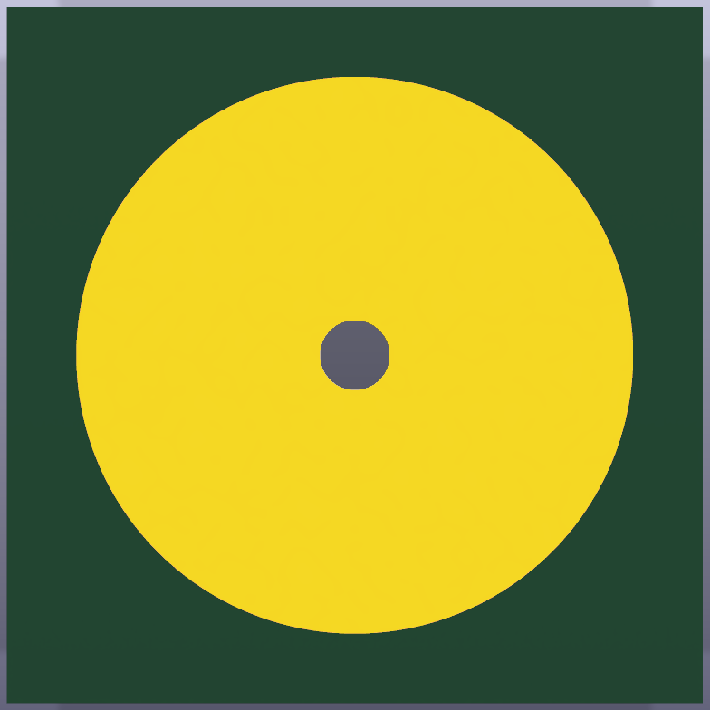
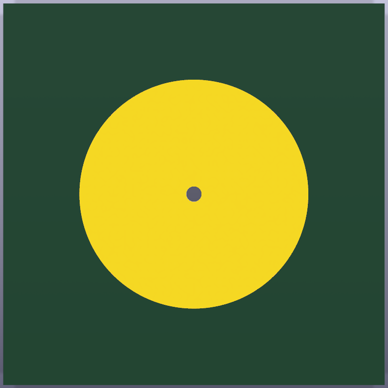
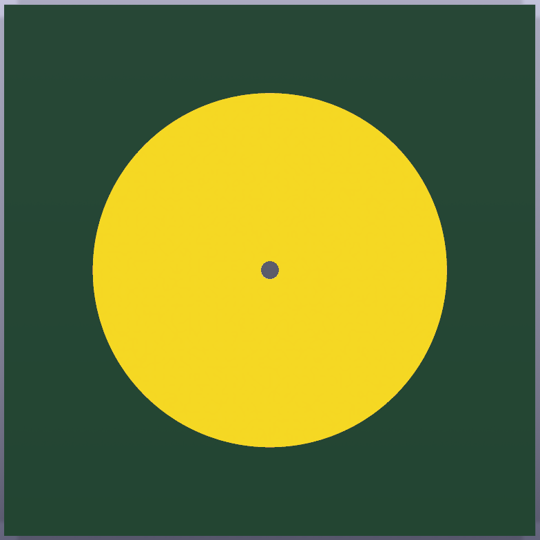

# Electrode Snap Adapter Series

This design family adapts circular thin-film electrodes to an exposed front copper pad intended for soldering a snap connector. Each board has one centered contact on each side and one centered drilled hole. The front contact is fixed at 8 mm; the back contact follows the thin-film electrode diameter.

The boards are intended for in-house fabrication on an LPKF U4. The machine does not create a plated barrel in this workflow, so the center hole is a manual interconnect: wick solder through the 1.0 mm drill to join the front and back copper, then verify continuity before attaching the film electrode.

## Series

| Variant file | Front snap pad | Back film-electrode pad | Square board | Limiting copper-to-edge margin |
| --- | ---: | ---: | ---: | ---: |
| `Circular_Contact_F8_B5_S10.kicad_pcb` | 8 mm | 5 mm | 10 mm | 1 mm |
| `Circular_Contact_F8_B10_S18p75.kicad_pcb` | 8 mm | 10 mm | 18.75 mm | 4.375 mm |
| `Circular_Contact_F8_B15_S25.kicad_pcb` | 8 mm | 15 mm | 25 mm | 5 mm |
| `Circular_Contact_F8_B20_S30.kicad_pcb` | 8 mm | 20 mm | 30 mm | 5 mm |

| Variant | Front | Back |
| --- | --- | --- |
| 8/5/10 |  |  |
| 8/10/18.75 |  |  |
| 8/15/25 |  |  |
| 8/20/30 |  |  |

The 20/30 mm, 15/25 mm, and 10/18.75 mm pairs are taken from the centered circle/square geometry in `electrode-size-test.dxf`. The source also explicitly labels a 5 mm electrode but does not contain a completed centered square for it; the 10 mm minimum board requested for this project is therefore used for the 5 mm variant.

## Geometry and fabrication contract

- Substrate: double-sided copper-clad board suitable for the available LPKF U4 process.
- Front: centered 8 mm exposed copper on `F.Cu/F.Mask`, with no paste aperture.
- Back: centered 5, 10, 15, or 20 mm exposed copper on `B.Cu/B.Mask`, with no paste aperture.
- Center interconnect: 2.0 mm copper diameter, 1.0 mm drilled hole, represented as the `CONTACT` via in KiCad.
- Physical interconnect: solder must be wicked through the drilled hole because the in-house process does not plate it.
- Outline: centered square from the table; no board side is less than 10 mm.
- Silkscreen: intentionally absent from both contact regions.
- Finish: bare copper or the finish available in the in-house process; clean and prepare the copper appropriately for the selected film-electrode attachment method.

The base project PCB is the largest 8/20/30 mm member. The four independently manufacturable family members are under `variants/`. The schematic is intentionally empty because this is a geometry-defined, single-net passive adapter.

## LPKF ProtoLaser U4 fabrication files

CircuitPro RP 1.x-compatible Gerber and Excellon packages for all four variants are under [`fabrication/u4/`](fabrication/u4/). Open exactly one variant directory and import its four machine files together. The machine-input directories intentionally contain no ZIP archive, Gerber job file, empty drill output, or documentation file. The parent fabrication README gives the exact layer mapping, complete-rub-out requirement, double-sided registration guidance, and the required non-plated center-hole solder operation.

## Regenerate the complete family

From the repository root:

```sh
python3 .agents/skills/kicad-pcb-layout/scripts/generate_circular_contact_board.py \
  --csv Designs/Electrode_Snap_Adapter_Series/series.csv \
  --output-dir Designs/Electrode_Snap_Adapter_Series/variants \
  --via-diameter 2 \
  --via-drill 1 \
  --force
```

Regenerate the base project board:

```sh
python3 .agents/skills/kicad-pcb-layout/scripts/generate_circular_contact_board.py \
  8 20 30 \
  --output-dir Designs/Electrode_Snap_Adapter_Series \
  --name Electrode_Snap_Adapter_Series \
  --via-diameter 2 \
  --via-drill 1 \
  --force
```

For another size, the only required geometry inputs remain `FRONT_DIAMETER BACK_DIAMETER BOARD_SIDE`. Keep the front value at 8 mm for this snap-connector family unless the connector changes.

## Assembly

1. Mill both copper patterns, drill the 1.0 mm center hole, and cut the square outline.
2. Deburr and clean both copper surfaces without removing the narrow edge margin on the 10 mm board.
3. Wick solder through the center hole until it wets both copper sides; avoid a large solder mound on the back where the film must sit flat.
4. Measure low resistance between the front and back pads before attaching the film electrode.
5. Attach the thin-film electrode concentrically to the matching back pad and solder the snap connector to the 8 mm front pad.

The 10 mm board has only 1 mm copper-to-edge margin around the 8 mm front pad. It meets the stated minimum size but is the least tolerant of cutter runout, registration error, and edge damage; manufacture it first as a process coupon before making a larger batch.
