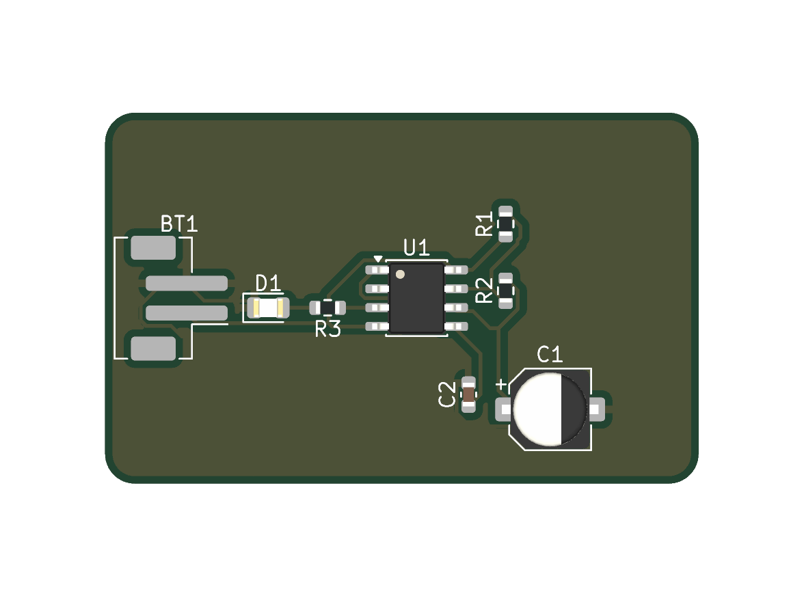

# LM555 LED Flasher

An educational astable 555 timer that flashes one LED. The design adapts the classroom topology into a compact, readable, all-SMT KiCad project intended for simple prototype fabrication.

## Circuit

- `U1`: LM555xM, SOIC-8.
- `R1`: 1 kΩ, 0603.
- `R2`: 100 kΩ, 0603.
- `R3`: 330 Ω LED current limiter, 0603.
- `C1`: 10 µF polarized SMD aluminum electrolytic, 5 × 5.3 mm.
- `C2`: 10 nF, 0603, control-voltage bypass.
- `D1`: generic indicator LED, 0805.
- `BT1`: 2-pin JST-PH SMD power connector.

The timing network follows the standard astable relationship approximately described by `f = 1.44 / ((R1 + 2R2) × C1)`. Actual flash rate depends on component tolerance, leakage, and the chosen 555 variant.

## Component Strategy

All board-mounted parts are SMT. The 0805 LED remains visible and hand-solderable; the 0603 passives keep the board compact without forcing unusually small geometry.

`C1` does not electrically have to be electrolytic. This implementation uses an SMD aluminum electrolytic because its effective 10 µF capacitance is more predictable across a typical low-voltage supply than a small high-value MLCC subject to DC-bias derating. A ceramic alternative should use an adequately rated 1206 or 1210 X7R part, verify effective capacitance at the actual bias voltage, and recalculate the timing range.

`D1` is intentionally generic because the classroom reference does not specify color or optical output. Select a real 0805 LED whose forward voltage and current are compatible with the supply, LM555 output capability, and `R3`; re-evaluate `R3` if those assumptions change.

## Layout Intent

- Board outline: approximately 40 mm × 25 mm with rounded corners.
- Components and all routing are on `F.Cu`.
- Zero vias and zero jumper resistors are used.
- Freerouting-derived tracks are 0.25 mm, with 45-degree bends and zero degree-two right-angle corners.
- The connector is placed at the left edge, the LED/output section follows it, the timer occupies the center, and timing components sit to the right.
- Designators and polarity marks are kept upright, visible, and inside the board.

## Reference Adaptation

The schematic preserves the classroom circuit's recognizable power rails, 555 pin relationships, timing divider, control bypass, and LED output path. Layout geometry was adjusted where KiCad symbol geometry, SMT packages, electrical loop length, or silkscreen readability required it.

## Manufacturing Outputs

[`fabrication/u4/LM555_LED_Flasher/`](fabrication/u4/LM555_LED_Flasher/) contains the PCB-derived CircuitPro package. [`fabrication/lightburn/LM555_LED_Flasher/`](fabrication/lightburn/LM555_LED_Flasher/) contains the PCB-derived front solder-mask DXF. The shared exporter infers the used copper side, mask side, and absence of drill data directly from the KiCad PCB.

The project routing menu now includes approximately 6–20 mil sizes, with a 0.25 mm
default, a selectable 0.1524 mm minimum and 0.20 mm clearance. The optimized 62-segment routing totals 123.26 mm. The generated [`variants/LM555_LED_Flasher_With_Pour.kicad_pcb`](variants/LM555_LED_Flasher_With_Pour.kicad_pcb)
uses the repository's 0.50 mm GND pour clearance and edge inset. Corresponding
`LM555_LED_Flasher_With_Pour` directories under all three fabrication formats contain the
second production option. The primary board remains the routing-only source.

## Limitations

This is a reference and experimental design, not a production release. Confirm the exact LM555 variant, supply range, LED, capacitor voltage rating, connector polarity, fabrication rules, and assembly process before building it.

U1 pin 1 uses explicit GND routing with no direct zone connection (`zone_connect 0`).
The 0.50 mm pour moat otherwise allowed only one thermal spoke at that pad; this
local assembly choice removes the starved thermal without relaxing the DRC rule.
Pad geometry and net assignment are unchanged.

## Supplier Gerbers and unified build

`./pcb build --design LM555_LED_Flasher` refreshes U4, LightBurn DXF and
[`fabrication/gerber/`](fabrication/gerber/) together. Each supplier package includes
all declared layers, the native Gerber job, PTH/NPTH drill files and `PACKAGE.md`
with layer mapping and order parameters to confirm. For the complete saved-design
routing workflow, use the repository [tool guide](../../tools/pcbflow/README.md).
